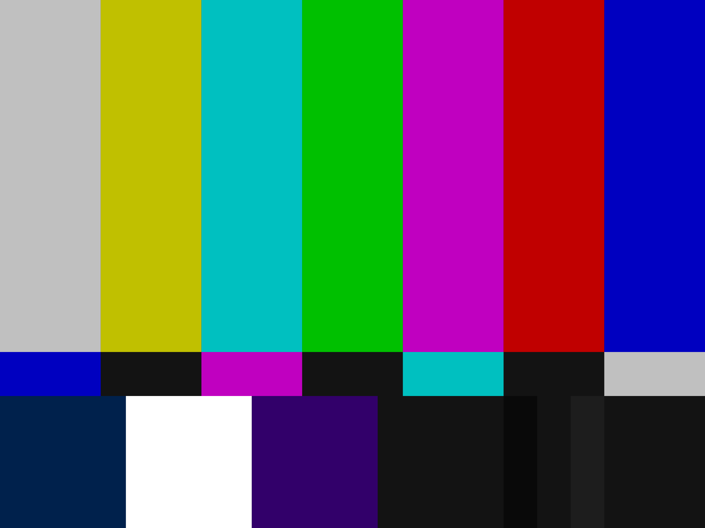
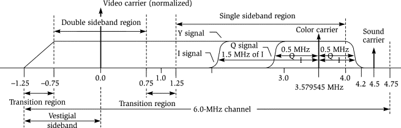

After 11 years, I'm finally back at the [Recurse Center](https://recurse.com). In preparing for my batch, I planned to work on something completely unrelated to video. I'd wanted to branch out into front- and back-end web development, learn some dev ops, and get into topics like distributed systems and CRDTs. But on the first day, I met the amazing Valadaptive, whose project [NTSC-RS](https://github.com/valadaptive) is a toolkit for building vintage image filters. I became fixated on the possibilities for iOS and started digging through the repo, learning about the project's predecessors and the foundations that give old video its distinctive look.

For context, my work at [1 Second Everyday](https://1se.co/) revolves entirely around video, and it's something that I've taken a deep interest in. Coincidentally, I've tried to build a naive camcorder filter multiple times in the past, even reaching out to Apple engineers for help thinking about the problem. I've scoured the web and [Shadertoy](https://www.shadertoy.com/) but I've never been happy with the results I've been able to produce. I didn't have a sense of how the adjustments that I'd built might converge on a realistic effect, or what other layers I'd need to build in order to make it happen. NTSC-RS felt like a map to buried treasure, but first I'd need to orient myself. The obvious question I faced was, "what even is NTSC video?"

## NTSC Video



Short for [National Television Standards Committee](https://en.wikipedia.org/wiki/NTSC), NTSC was the original standard for analog TV in the US, and evolved in 1953 to support color TV. TVs and VHS players and cameras in the Americas and elsewhere used the [NTSC color system](https://en.wikipedia.org/wiki/NTSC#SMPTE_C), encoded to YIQ (Luminance, In-Phase, Quadrature,) until the rise of digital technologies in the 1990s. Backward compatibility with black-and-white sets was maintained by transmitting the black-and-white luminance data on a separate subcarrier from the chroma (color) channels, much in the same way stereo FM radio works. 



Ultimately, this YIQ model would be the key to the whole project. The basic architecture would look like this:

1. Decode an input frame
2. Convert the RGB data to YIQ
3. Perform some operations on the YIQ data
4. Convert back to RGB
5. Render

Step 3 is where the real work of the filter would happen, by applying blurs, highpass and lowpass filters, noise, etc. to one or more of the three YIQ channels. This would be how to achieve effects like color bleed, luminance noise, or bleeding from luma into chroma (and vice versa.)[^1]

## Porting to Swift and Core Image

Getting started, my game plan was to port the existing Rust code to Swift and Core Image, moving off the CPU and onto the GPU in order to have something performant enough for live video recording or filtering live video playback. Along the way I could run the Rust code, writing tests on both platforms and stepping through them in the debugger to make sure I was on the right track.

All of the image processing I'd done up to this point used Apple's Core Image framework, which has a multitude of builtin filters that can be composed together in a performant way. When you need custom filters you can write a [`CIColorKernel`](https://developer.apple.com/documentation/coreimage/cicolorkernel#) in Metal using the Metal Shader Language (a dialect of C++.) I assumed that this is the approach I'd use to write my NTSC code. It was not to be.

The big thing I'd overlooked is that in the RGB color model, channel values are bounded by 0. You can't have an R, G, or B value that's less than pure black. But YIQ isn't bounded in this way, and negative values are commonplace. My plan had been to store YIQ images as regular CIImages, but the zero lower bound made this impossible. Enter Metal.

## Metal for Image Processing

Metal is Apple's graphics programming framework, designed as a modern low-level replacement for OpenGL on Apple's platforms. As I mentioned above, Core Image kernels are written in Metal already. I just needed to make sure that I'd be able to store negative values in my "pixel data," then I could simply store Y, I, and Q values where R, G, and B ones would ordinarily be.

When writing image processing code in Metal, the two main components are textures and shaders. Textures can be thought of as multidimensional arrays of vectors, and for our purposes are the backing stores for our images' pixel data. Shaders are programs written to be executed on the GPU, and the ones we care about (fragment shaders) are designed to be run once per pixel. In this way, you could say that `CIColorKernel`s are themselves a special kind of fragment shader.

Unlike regular Core Image code, which is essentially functional (input image in, output image out,) Metal shaders will take one or more input textures as arguments and write to an output texture. Here's some sample code to give you an idea

```swift
let encoder: MTLComputeCommandEncoder = ...
encoder.setTexture(input, index: 0)
encoder.setTexture(output, index: 1)
var min: Float16 = min
encoder.setBytes(&min, length: MemoryLayout<Float16>.size, index: 0)
var max: Float16 = max
encoder.setBytes(&max, length: MemoryLayout<Float16>.size, index: 1)
```

You can see that we're setting textures and values on the encoder, assigning indices to each one. This is how we'll be able to access them on the Metal side.

```msl
kernel void mix
(
 texture2d<half, access::read> input [[texture(0)]],
 texture2d<half, access::write> out [[texture(1)]],
 constant half &min [[buffer(0)]],
 constant half &max [[buffer(1)]],
 uint2 gid [[thread_position_in_grid]]
 ) {
    half4 px = input.read(gid);
    half4 mixed = mix(min, max, px);
    out.write(mixed, gid);
}
```

The line `kernel void mix` declares a Metal kernel (shader) whose return type is `void` and name is `mix`. We have access to the two textures and two values that we set in the Swift code, taking care to make sure the indices match up (note that 16-bit floating point numbers are called `half`s in Metal but they're identical to Swift's `Float16` type. Ditto `float` and `Float`.) The last three lines read a pixel from the `input` texture using `gid` (the current XY coordinate,) call the `mix` [function in Metal](https://developer.apple.com/metal/Metal-Shading-Language-Specification.pdf) (different from our kernel with the same name) using the pixel data and our `min` and `max` arguments, and write the new pixel back out to `out`. Finally, we can use an `MTKView` to get this texture data onscreen.[^2] Note that `input` and `out` have access values of `read` and `write`, respectively. This protects you from accidentally writing to your input texture or vice versa. Similarly, the texture and buffer indices are checked for uniqueness at compile time. It's no Swift type system, but it's something.

## Boilerplate

"Sure," you might ask, "but how do I actually get the GPU to run this code?" Generally, there's some boilerplate that we need to do every frame:

1. Get a command buffer
2. For each function we want to call, encode it and its textures and data to the buffer
3. Commit the buffer (and optionally wait for it to finish executing)

### 1. Getting Command Buffers

You get these from a `MTLCommandQueue`. You only ever need one queue so you'll want to create it and hold onto it, since they're expensive to create. You do this using your `MTLDevice`, which itself is the root-level object for interacting with Metal. Generally, you'll get access to a device instance by calling `MTLCreateSystemDefaultDevice`.

```swift
class MyClass {
    private let device: MTLDevice
    private let commandQueue: MTLCommandQueue
    init?() {
        guard let device = MTLCreateSystemDefaultDevice() else {
            return nil
        }
        self.device = device
        guard let commandQueue = device.makeCommandQueue() else {
            return nil
        }
        self.commandQueue = commandQueue
    }
}

extension MyClass: MTKViewDelegate {
    func draw(in view: MTKView) {
        guard let commandBuffer = commandQueue.makeCommandBuffer() else {
            return
        }
        ...
    }
}

```

As shown above, you'll usually want to generate a command buffer in response to some event, say an [`MTKViewDelegate` callback](https://developer.apple.com/documentation/metalkit/mtkviewdelegate/draw(in:)) or [`AVVideoCompositing.startRequest(_:)`](https://developer.apple.com/documentation/avfoundation/avvideocompositing/1388894-startrequest). You can think of command buffers as "buffers full of commands" that you're going to send to the GPU.

### 2. Encoding Function Calls

The basic pattern is going to look like this

```swift
// Get a command encoder from the buffer to encode a command
let encoder: MTLComputeCommandEncoder = commandBuffer.makeComputeCommandEncoder()!

// Set up the pipeline state (i.e., encode a reference to your function)
let library: MTLLibrary = device.makeDefaultLibrary()!
let fn: MTLFunction = library.makeFunction(name: "mix")!
let pipelineState: MTLComputePipelineState = device.makeComputePipelineState(function: fn)!
encoder.setComputePipelineState(pipelineState)

// Encode references to your textures and parameters
encoder.setTexture(...)
encoder.setBytes(...)

// Dispatch threads (describe how you want the GPU to process the request)
encoder.dispatchThreads(...)
encoder.endEncoding()
```

A couple of points to keep in mind:

1. You want to instantiate your library once and hold a reference to it
2. Your pipeline states are expensive to create and should be cached and reused (you can use a dictionary keyed by function name)
3. We covered setting textures and bytes above. [`MTLBuffer`s](https://developer.apple.com/documentation/metal/mtlbuffer#) behave the same if you need to use those.
4. If you don't call `dispatchThreads(_:threadsPerThreadgroup:)` your function won't actually be invoked.
5. You need to remember to call `endEncoding`, otherwise you'll get a crash when you start trying to encode your next command.

I'm not really sure about the science of `dispatchThreads`, but the approach I've been taking is to use:

a) MTLSize(width: textureWidth, height: textureHeight, depth: 1) for `threadsPerGrid`
b) MTLSize(width: 8, height: 8, depth: 1) for `threadsPerThreadgroup`

I don't really have anything to add here other than that this method details how you want Metal to apportion resources to run your function. The first argument represents the total number of elements (pixels) that need to be processed, and the second is how big you want your threadgroups to be (how much parallelism you want.) [Here's a link](https://developer.apple.com/documentation/metal/compute_passes/creating_threads_and_threadgroups) to the developer documentation if you're interested in learning more.

### 3. Committing

```swift
let buffer: MTLCommandBuffer = ...
...

buffer.commit()
buffer.waitUntilCompleted()
```

In our case, we want to wait until the buffer has been processed so that we can use our final texture to render a `CIImage` or whatever but that's pretty much it!

## Recap

Now that we know how to set up a Metal pipeline, encode functions and data, and get our code to run on the GPU, we can build arbitrary image processing tools outside of what's achievable with Core Image alone. To recap:

1. Some objects are long-lived: MTLDevice, MTLCommandQueue, and MTLLibrary, as well as a pool of MTLTextures (covered in the next post)
2. Every time we render a frame, we need to encode all of the functions that we want to call, along with references to textures and any data that the functions need in order to run. We do this with a fresh command encoder for each function invocation. The functions will run in the order they've been added to the command buffer.
3. Part of encoding a function invocation is making sure you've set up the correct pipeline state, dispatched threads, and ended encoding.

In the next post I'll detail how to integrate a Metal pipeline with video streams, show you some glue code to make everything a little less verbose, and take a step back to look at the trip a command buffer takes through your image pipeline. 

[^1]: There's a whole catalog of effects at the [AV Artifact Atlas](https://www.avartifactatlas.com/)

[^2]: This really depends on your use case. If you're applying a filter to frames in an AVAsset you probably want an AVPlayerLayer and an implementation of [`AVVideoCompositing`](https://developer.apple.com/documentation/avfoundation/avvideocompositing#).